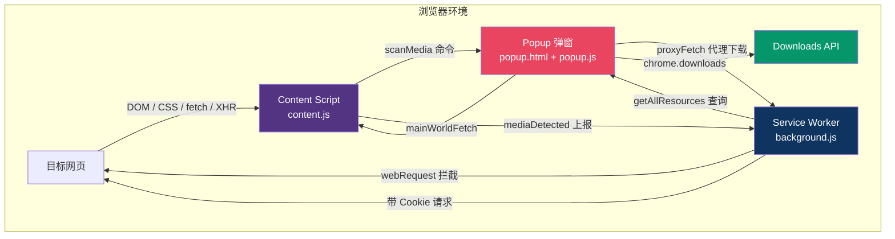
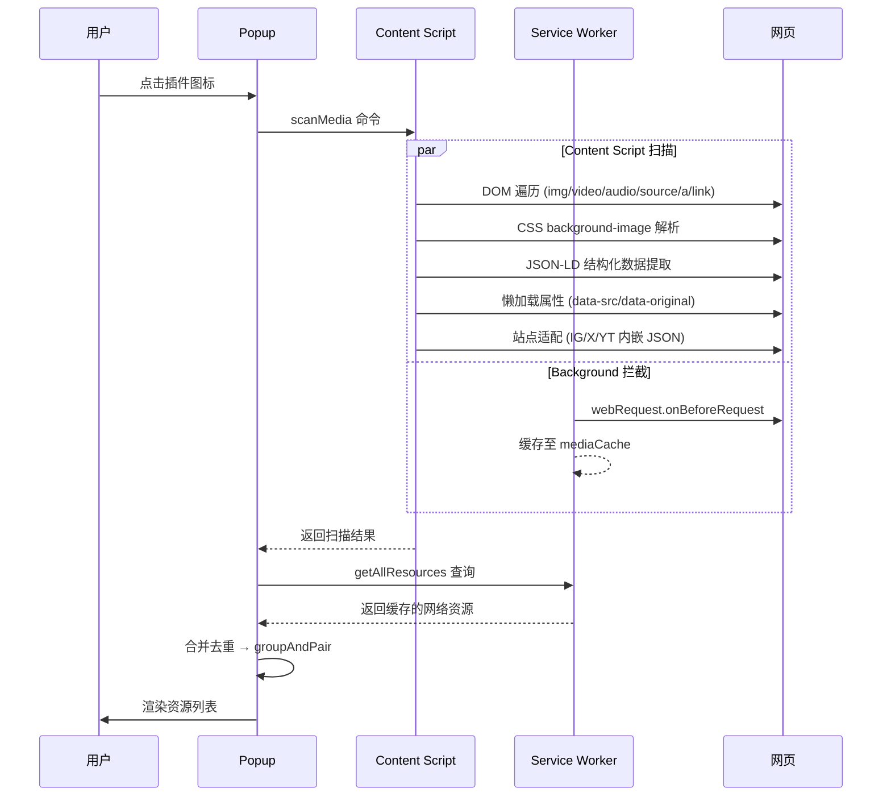
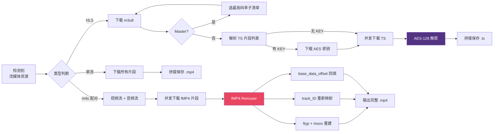
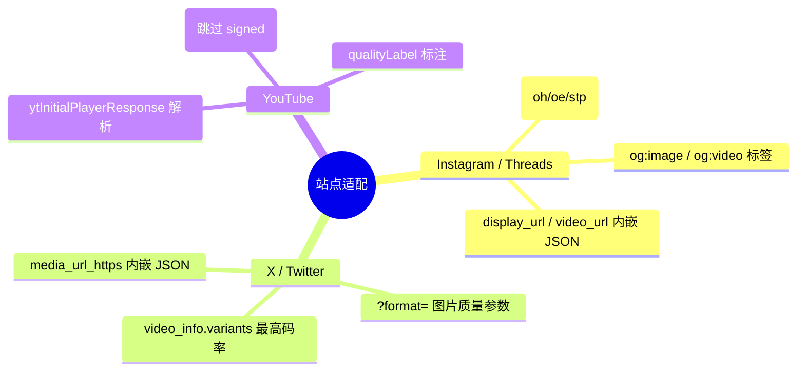

# Media Sniffer

<p align="center">
  
</p>

<p align="center">
  
  
  
</p>

<p align="center"><b>一键嗅探网页图片 · 音频 · 视频，支持 HLS 与 DASH 流媒体完整下载合并</b></p>

---

## 架构总览



### 三组件协作

| 组件 | 文件 | 职责 |
|------|------|------|
| **Popup** | `popup.html` + `popup.js` | 用户界面：资源列表、筛选、下载触发、进度展示、fMP4 Remuxer |
| **Content Script** | `content.js` | 页面注入：DOM 扫描、fetch/XHR 拦截、站点适配（IG/X/YT）、SPA 路由监听 |
| **Service Worker** | `background.js` | 后台持久：webRequest 网络拦截、代理下载（带 Cookie/Referer） |

---

## 资源检测流程



---

## 流媒体下载流程



---

## Popup 界面

```
┌───────────────────────────────────────────────┐
│  Media Sniffer                          ⟳    │← header
├───────────────────────────────────────────────┤
│  当前页面标题                                   │← page-info
├───────────────────────────────────────────────┤
│  [ 全部 ] [ 图片 ] [ 视频 ] [ 音频 ]             │← filters
├───────────────────────────────────────────────┤
│  6 个资源                        [全部下载]    │← stats
├───────────────────────────────────────────────┤
│  ┌──────┐  video_114514.mp4                    │
│  │  🎬  │  video · 视频文件 · network    [下载] │← resource-item
│  └──────┘                                      │
│  ┌──────┐  photo_beauty.jpg                    │
│  │  🖼  │  image · image · img   [预览] [下载] │
│  └──────┘                                      │
│  ┌──────┐  output.m3u8                         │
│  │  🎬  │  video · HLS · network  [合并下载]   │
│  └──────┘  [复制链接]                          │
│  ┌──────┐  完整视频                             │
│  │  🎬  │  video · paired-stream  [下载]       │← 视频+音频配对
│  └──────┘                                      │
├───────────────────────────────────────────────┤
│  下载中...                              ✕     │
│  ████████████░░░░░░░░░░ 67%                     │← 下载面板 (条件显示)
│  4 / 6 片段                                    │
│  视频: 12.3MB  音频: 3.2MB  合并中...            │
└───────────────────────────────────────────────┘
```

---

## 功能特性

### 检测策略

| 来源 | 说明 |
|------|------|
| 🖼 **DOM 元素** | ``, `<video>`, `<audio>`, `<source>`, `<picture>`, `<a>` |
| 🎨 **CSS 背景** | `background-image`, 懒加载属性 `data-src` / `data-original` |
| 📡 **网络拦截** | Hook `fetch()` + `XMLHttpRequest`，Service Worker `webRequest` |
| 📋 **JSON-LD** | 结构化数据中的媒体 URL |
| ⚡ **预加载** | `<link rel="preload">` 标签 |
| 🏷 **站点适配** | Instagram / X / YouTube 内嵌 JSON 解析 |

### 流媒体

| 格式 | 能力 |
|------|------|
| 📺 **HLS (m3u8)** | 多级清单解析 · 自动选最高码率 · AES-128 解密 · 并发 TS 拼接 |
| 📦 **DASH (m4s)** | 视频/音频自动配对 · fMP4 Remuxer 合并为完整 MP4 · ID 映射防冲突 |

### 站点适配



---

## 安装与使用

### 安装

| 浏览器 | 步骤 |
|--------|------|
| **Chrome / Edge** | `chrome://extensions/` → 开启开发者模式 → 加载已解压的扩展程序 → 选择项目目录 |
| **Firefox** | `about:debugging#/runtime/this-firefox` → 临时载入附加组件 → 选择 `manifest.json` |

### 使用

| 目标 | 操作 |
|------|------|
| 扫描资源 | 打开目标页面 → 点击插件图标（自动扫描）或点 ⟳ 手动刷新 |
| 筛选 | 点击「全部 / 图片 / 视频 / 音频」分类按钮 |
| 下载 | 单个点击「下载」；批量点击「全部下载」 |
| 预览图片 | 点击图片资源的「预览」按钮 |
| 复制链接 | 点击「复制链接」→ 自动写入剪贴板 |
| **HLS 下载** | 找到带 `HLS` 标签的资源 → 点击「合并下载」→ 自动解析+解密+拼接 |
| **DASH 合并** | 等待配对完成（显示「完整视频」标签）→ 点击「下载」→ fMP4 自动合并 |

> 💡 打开视频页面后先播放几秒，再点击插件图标，可自动捕获正在缓冲的流媒体资源。

---

## 权限

| 权限 | 用途 |
|:--|:--|
| `storage` | 插件设置存储 |
| `activeTab` | 读取活动标签页信息 |
| `scripting` | 注入 Content Script 与 Main World fetch |
| `downloads` | 保存文件到本地磁盘 |
| `tabs` | 获取页面 URL / 标签页状态 |
| `webRequest` | Service Worker 层拦截网络请求 |
| `cookies` | 代理下载携带站点 Cookie |
| `host_permissions` | 在所有网站运行 (`<all_urls>`) |

---

## 调试

| 目标 | 入口 |
|------|------|
| **Popup** | 右键插件图标 → 检查弹出内容 |
| **Content Script** | 打开页面 F12 → Console 标签 |
| **Service Worker** | `chrome://extensions/` → 点击插件 `service worker` 链接 |

---

## 技术要点

### fMP4 Remuxer

内嵌轻量级 **ISOBMFF (MP4)** 解析与重写器：

- **Box 扫描**：ftyp / moov / moof / mdat 四类盒子递归解析
- **track_ID 映射**：视频 ID → 1，音频 ID → 2，避免合并冲突
- **moov 重建**：合并视频 + 音频 trak，重建 mvex / trex 盒子
- **回填修复**：mvhd `next_track_id`、所有片段 `base_data_offset` 重计算
- **零依赖**：纯 JavaScript ArrayBuffer 位运算，无需 Emscripten / FFmpeg

### 下载代理 (proxyFetch)

Service Worker 发起 HTTP 请求时自动注入：

| Header | 值 |
|--------|-----|
| `Referer` / `Origin` | 站点自适应 (ig/x/yt) |
| `Cookie` | `chrome.cookies` API 自动提取 |
| `User-Agent` | Chrome 标准 Desktop UA |

绕过 CORS、CDN Referer 校验与防盗链。

---

## 项目结构

```
plugin/
├── manifest.json      # 插件清单 (Manifest V3)
├── background.js      # Service Worker：网络拦截 · 代理下载
├── content.js         # Content Script：DOM 扫描 · fetch/XHR · 站点适配
├── content.css        # 页面浮动按钮样式
├── popup.html         # 弹窗页面 (400×500)
├── popup.js           # 弹窗逻辑：列表 · 下载 · HLS/DASH · Remuxer
├── popup.css          # 弹窗暗色主题
├── icons/             # 图标 (16/48/128)
└── README.md
```

---

## License

MIT
